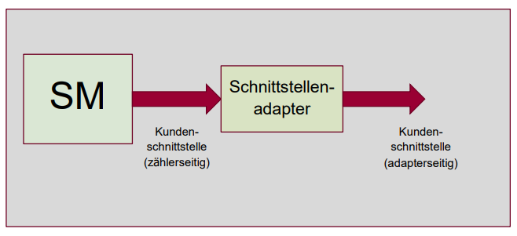
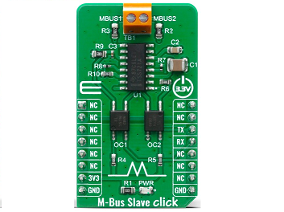
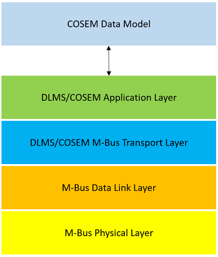

# Smart Meter Kundenschnittstelle Tirol

In Österreich müssen alle intelligenten Messgeräte (Smart Meters) über eine
Kommunikationsschnittstelle verfügen, über welche sie mit in der Kundenanlage
vorhandenen externen Geräten kommunizieren können und alle erfassten
(Stromverbrauchs-)Daten ausgeben können.
Diese Schnittstelle (in weiterer Folge auch kurz als Kundenschnittstelle bezeichnet)
ist allerdings nur für die unidirektionale Ausgabe von
Daten und Informationen vorgesehen. Eine Verwendung der Schnittstelle zur
Steuerung des Zählers ist nicht vorgesehen.

Um Unberechtigten den Zugriff auf die Daten nicht zu ermöglichen, ist die
Kommunikation über diese Schnittstelle nach dem Stand der Technik mit einem
individuellen kundenbezogenen Schlüssel zu authentisieren und zu verschlüsseln.
Außerdem ist die Schnittstelle standardmäßig deaktiviert.

Ziel der nachfolgenden Abschnitte ist es zu beschreiben, wie berechtigte Personen
(Kunden) die Daten aus ihren Zählern auslesen können.

# Geltungsbereich

Da es österreichweit keine einheitliche (technische) Ausprägung der Kundenschnittstelle
gibt, beschränkt sich die nachfolgende Beschreibung auf die im Land Tirol von den
beiden Netzbetreibern [TINETZ-Tiroler Netze GmbH](https://www.tinetz.at/) und
[Innsbrucker Kommunalbetriebe Aktiengesellschaft (IKB)](https://www.ikb.at/) verbauten
Gerätetypen der Hersteller Kaifa und Honeywell.
(Nach aktuellem Kenntnisstand werden letztere in identischer Konfiguration auch
von den Netzbetreibern [Salzburg Netz GmbH](https://www.salzburgnetz.at/) und
[Vorarlberger Energienetze GmbH](https://www.vorarlbergnetz.at/) verwendet.)

# Typisches Setup für die Datenauslesung

Aufgrund der Tatsache, dass es sich bei den im Zusammenhang mit der Kundenschnittstelle
eingesetzten physikalischen Schnittstellen im Allgemeinen nicht um Schnittstellen aus
dem Consumer-Bereich (wie bspw. WLAN oder Bluetooth), sondern um Schnittstellen aus
dem Industrie-Bereich (M-Bus im Fall der Smart Meter in Tirol) handelt, wird in den
meisten Fällen ein Schnittstellenadapter nötig sein, der die Anpassung der Kudenschnittstelle
an in Kundenanlagen gängige Schnittstellen vornimmt:

Eine detaillierte Beschreibung derartiger Schnittstellenadapter liegt allerdings nicht
im Fokus der gegenständlichen Betrachtung.

## Schnittstellenadapter für den M-Bus (Meter-Bus)

Für die oben erwähnten Zähler der TINETZ und IKB, deren Kundenschnittstelle als M-Bus
ausgeführt ist, kann beispielsweise der folgende Schnittstellenadapter
([M-Bus to UART board](https://www.mikroe.com/m-bus-slave-click/)) verwendent werden,
um eine handelsübliche serielle Schnittstelle für die Datenauslesung (bspw. per PC oder
Raspberry Pi) bereitzustellen:

Mögliche Bezugsquellen sind:
 - [MikroElektronika](https://www.mikroe.com/m-bus-slave-click/)
 - [Digi-Key](https://www.digikey.at/)
 - [Mouser Electronics](https://www.mouser.at)

## Generischer Schnittstellenadapter

Zur Vereinheitlichung der unterschiedlichen Ausprägungen der Kundenschnittstelle in
Österreich wird seitens der Interessenvertretung der
[österreichischen E-Wirtschaft](https://oesterreichsenergie.at/)
zudem an einem
[*Konzept für einen Smart-Meter Kundenschnittstellen-Adapter zur Standardisierung der Datenbereitstellung in der Kundenanlage*](https://oesterreichsenergie.at/fileadmin/user_upload/Smart_Meter-Plattform/20200201_Konzept_Kundenschnittstelle_SM.pdf)
gearbeitet, der mit allen österreichischen Smart Metern kompatibel sein soll. 

# Datenmodell und Datenübertragung

Die nachfolgende Tabelle listet alle über die Kundenschnittstelle übertragenen Messwerte
und sonstige relevante Daten auf:

OBIS-Code | Attribut
--------- | --------
0-0:1.0.0.255,1 | Clock Attribute 1 - OBIS Code
0-0:1.0.0.255,2 | Clock attribute 2 - Datum und Uhrzeit
0-0:96.1.0.255 | Zählernummer des Netzbetreibers
0-0:42.0.0.255 | COSEM logical device name
1-0:32.7.0.255 | Spannung L1 (V)
1-0:52.7.0.255 | Spannung L2 (V)*
1-0:72.7.0.255 | Spannung L3 (V)*
1-0:31.7.0.255 | Strom L1 (A)
1-0:51.7.0.255 | Strom L2 (A)*
1-0:71.7.0.255 | Strom L3 (A)*
1-0:1.7.0.255 | Wirkleistung Bezug +P (W)
1-0:2.7.0.255 | Wirkleistung Lieferung -P (W)
1-0:1.8.0.255 | Wirkenergie Bezug +A (Wh)
1-0:2.8.0.255 | Wirkenergie Lieferung -A (Wh)
1-0:3.8.0.255 | Blindleistung Bezug +R (Wh)
1-0:4.8.0.255 | Blindleistung Lieferung -R (Wh)

\* Werte werden ausschließlich bei Drehstrom-Zählern ausgegeben.

Diese Daten werden vom Zähler (ohne explizite Anforderung) im unidirektionalen
Push-Betrieb im 5 Sekundentakt auf der Kundenschnittstelle ausgegeben.

Weitere Details zur Datenübertragung, dem Datenmodell und der Datensicherheit
werden in den folgenden Abschnitten angeführt.

> Bei Bedarf können darüber hinausgehende Informationen in der aktuellen
> [DLMS/COSEM Spezifikation](https://www.dlms.com/) (Green Book) nachgelesen werden,
> vor allem in den Abschnitten 10.5.3 und 10.5.4.

# Protokollstack

Die technische Datenübertragung basiert auf einem Protokollstack auf Basis von
M-Bus auf den unteren Protokollschichten in Kombination mit einer DLMS/COSEM
Applikationsschicht. Darüber werden die als COSEM-Objekte codierten Nutzdaten
in verschlüsselter Form übertragen.

Protokollschicht | Detailbeschreibung zu finden in (Spezifikation/Standard/Norm)
---------------- | -------------------------------------------------------------
DLMS/COSEM Application Layer | [DLMS/COSEM Spezifikation](https://www.dlms.com/) (Green Book, Kapitel 9) bzw. IEC 62056-5-3
DLMS/COSEM M-Bus Transport Layer | EN 13757-3 (M-Bus Transport Layer) und Green Book 10.5.4.6 (M-Bus wrapper)
M-Bus Data Link Layer | EN 13757-2
M-Bus Physical Layer | EN 13757-2

# Datensicherheit

Wie eingangs bereits erwähnt, ist die Kommunikation über die Kundenschnittstelle
nach dem Stand der Technik mit einem individuellen kundenbezogenen Schlüssel zu
authentisieren und zu verschlüsseln, um Unberechtigten den Zugriff auf die Daten
nicht zu ermöglichen. Dazu einige markante Eckpunkte:

- Die Verschlüsselung findet in der Applikationsschicht statt (nicht in der Transportschicht).
- Verwendeter Sicherheitsstandard: DLMS/COSEM Security Suite 1
- Verschlüsselungsalgorithmus: AES-GCM (Advanced Encryption Standard - Galois/Counter Mode)
- Schlüssellänge: 128 bits

Um die Kundenschnittstelle zu aktivieren und den notwendigen, kundenindividuellen Schlüssel
zu erhalten, wendet man sich entweder direkt an seinen Netzbetreiber oder beantragt die
Aktivierung und Zusendung des Schlüssels online im Kundenportal des Netzbetreibers; für den
Netzbetreiber TINETZ beispielsweise unter
[kundenportal.tinetz.at](https://kundenportal.tinetz.at/).  

# Physikalische Datenübertragung und logische Frame-Struktur

Ziel der Beschreibung ist die Interpretation des ausgelesenen Byte-Streams (Entschlüsselung und Dekodierung der Nutzdaten)

## Physikalische Datenübertragung

alle notwendigen PHY - Parameter angeben: bd rate etc.
    cf. also https://m-bus.com/documentation-wired/05-data-link-layer

## Logische Frame-Struktur

# To-do

Protokoll-Stack: ergänze COSEM Datenmodell in Bild (analog GB 8.0 Seite 375)

Felder erklären: welche sind statisch, welche dyn?
Fragmentierung erklären
Ver- und Entschlüsselung erklären, encr. only no auth.
Beispiel mit Walkthrough
