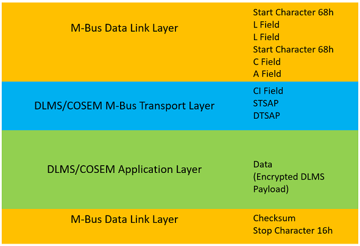
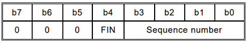

# Smart Meter Kundenschnittstelle Tirol

In Österreich müssen alle intelligenten Messgeräte (Smart Meters) über eine
Kommunikationsschnittstelle verfügen, über welche sie mit in der Kundenanlage
vorhandenen externen Geräten kommunizieren können und alle erfassten
(Stromverbrauchs-)Daten ausgeben können.
Diese Schnittstelle (in weiterer Folge auch kurz als Kundenschnittstelle bezeichnet)
ist allerdings nur für die unidirektionale Ausgabe von
Daten und Informationen vorgesehen. Eine Verwendung der Schnittstelle zur
Steuerung des Zählers ist nicht vorgesehen.

Um Unberechtigten den Zugriff auf die Daten nicht zu ermöglichen, ist die
Kommunikation über diese Schnittstelle nach dem Stand der Technik mit einem
individuellen kundenbezogenen Schlüssel zu authentisieren und zu verschlüsseln.
Außerdem ist die Schnittstelle standardmäßig deaktiviert.

Ziel der nachfolgenden Abschnitte ist es zu beschreiben, wie berechtigte Personen
(Kunden) die Daten aus ihren Zählern auslesen können.

# Geltungsbereich

Da es österreichweit keine einheitliche (technische) Ausprägung der Kundenschnittstelle
gibt, beschränkt sich die nachfolgende Beschreibung auf die im Land Tirol von den
beiden Netzbetreibern [TINETZ-Tiroler Netze GmbH](https://www.tinetz.at/) und
[Innsbrucker Kommunalbetriebe Aktiengesellschaft (IKB)](https://www.ikb.at/) verbauten
Gerätetypen der Hersteller Kaifa und Honeywell.
(Nach aktuellem Kenntnisstand werden letztere in identischer Konfiguration auch
von den Netzbetreibern [Salzburg Netz GmbH](https://www.salzburgnetz.at/) und
[Vorarlberger Energienetze GmbH](https://www.vorarlbergnetz.at/) verwendet.)

# Typisches Setup für die Datenauslesung

Aufgrund der Tatsache, dass es sich bei den im Zusammenhang mit der Kundenschnittstelle
eingesetzten physikalischen Schnittstellen im Allgemeinen nicht um Schnittstellen aus
dem Consumer-Bereich (wie bspw. WLAN oder Bluetooth), sondern um Schnittstellen aus
dem Industrie-Bereich (M-Bus im Fall der Smart Meter in Tirol) handelt, wird in den
meisten Fällen ein Schnittstellenadapter nötig sein, der die Anpassung der Kudenschnittstelle
an in Kundenanlagen gängige Schnittstellen vornimmt:

Eine detaillierte Beschreibung derartiger Schnittstellenadapter liegt allerdings nicht
im Fokus der gegenständlichen Betrachtung.

## Schnittstellenadapter für den M-Bus (Meter-Bus)

Für die oben erwähnten Zähler der TINETZ und IKB, deren Kundenschnittstelle als M-Bus
ausgeführt ist, kann beispielsweise der folgende Schnittstellenadapter
([M-Bus to UART board](https://www.mikroe.com/m-bus-slave-click/)) verwendent werden,
um eine handelsübliche serielle Schnittstelle für die Datenauslesung (bspw. per PC oder
Raspberry Pi) bereitzustellen:

Mögliche Bezugsquellen sind:
 - [MikroElektronika](https://www.mikroe.com/m-bus-slave-click/)
 - [Digi-Key](https://www.digikey.at/)
 - [Mouser Electronics](https://www.mouser.at)

## Generischer Schnittstellenadapter

Zur Vereinheitlichung der unterschiedlichen Ausprägungen der Kundenschnittstelle in
Österreich wird seitens der Interessenvertretung der
[österreichischen E-Wirtschaft](https://oesterreichsenergie.at/)
zudem an einem
[*Konzept für einen Smart-Meter Kundenschnittstellen-Adapter zur Standardisierung der Datenbereitstellung in der Kundenanlage*](https://oesterreichsenergie.at/fileadmin/user_upload/Smart_Meter-Plattform/20200201_Konzept_Kundenschnittstelle_SM.pdf)
gearbeitet, der mit allen österreichischen Smart Metern kompatibel sein soll. 

# Datenmodell und Datenübertragung

Die nachfolgende Tabelle listet alle über die Kundenschnittstelle übertragenen Messwerte
und sonstige relevante Daten auf:

OBIS-Code | Attribut
--------- | --------
0-0:1.0.0.255,1 | Clock Attribute 1 - OBIS Code
0-0:1.0.0.255,2 | Clock attribute 2 - Datum und Uhrzeit
0-0:96.1.0.255 | Zählernummer des Netzbetreibers
0-0:42.0.0.255 | COSEM logical device name
1-0:32.7.0.255 | Spannung L1 (V)
1-0:52.7.0.255 | Spannung L2 (V)*
1-0:72.7.0.255 | Spannung L3 (V)*
1-0:31.7.0.255 | Strom L1 (A)
1-0:51.7.0.255 | Strom L2 (A)*
1-0:71.7.0.255 | Strom L3 (A)*
1-0:1.7.0.255 | Wirkleistung Bezug +P (W)
1-0:2.7.0.255 | Wirkleistung Lieferung -P (W)
1-0:1.8.0.255 | Wirkenergie Bezug +A (Wh)
1-0:2.8.0.255 | Wirkenergie Lieferung -A (Wh)
1-0:3.8.0.255 | Blindleistung Bezug +R (Wh)
1-0:4.8.0.255 | Blindleistung Lieferung -R (Wh)

\* Werte werden ausschließlich bei Drehstrom-Zählern ausgegeben.

Diese Daten werden vom Zähler (ohne explizite Anforderung) im unidirektionalen
Push-Betrieb im 5 Sekundentakt auf der Kundenschnittstelle ausgegeben.

Weitere Details zur Datenübertragung, dem Datenmodell und der Datensicherheit
werden in den folgenden Abschnitten angeführt.

> Bei Bedarf können darüber hinausgehende Informationen in der aktuellen
> [DLMS/COSEM Spezifikation](https://www.dlms.com/) (Green Book) nachgelesen werden,
> vor allem in den Abschnitten 10.5.3 und 10.5.4.

# Protokollstack

Die technische Datenübertragung basiert auf einem Protokollstack auf Basis von
M-Bus auf den unteren Protokollschichten in Kombination mit einer DLMS/COSEM
Applikationsschicht. Darüber werden die als COSEM-Objekte codierten Nutzdaten
in verschlüsselter Form übertragen.

Protokollschicht | Detailbeschreibung zu finden in (Spezifikation/Standard/Norm)
---------------- | -------------------------------------------------------------
COSEM Data Model | [DLMS/COSEM Spezifikation](https://www.dlms.com/) (Blue Book) bzw. IEC 62056-6-1, IEC 62056-6-2
DLMS/COSEM Application Layer | [DLMS/COSEM Spezifikation](https://www.dlms.com/) (Green Book, Kapitel 9) bzw. IEC 62056-5-3
DLMS/COSEM M-Bus Transport Layer | EN 13757-3 (M-Bus Transport Layer) und Green Book 10.5.4.6 (M-Bus wrapper)
M-Bus Data Link Layer | EN 13757-2
M-Bus Physical Layer | EN 13757-2

# Datensicherheit

Wie eingangs bereits erwähnt, ist die Kommunikation über die Kundenschnittstelle
nach dem Stand der Technik mit einem individuellen kundenbezogenen Schlüssel zu
authentisieren und zu verschlüsseln, um Unberechtigten den Zugriff auf die Daten
nicht zu ermöglichen. Dazu einige markante Eckpunkte:

- Die Verschlüsselung findet in der Applikationsschicht statt (nicht in der Transportschicht).
- Verwendeter Sicherheitsstandard: DLMS/COSEM Security Suite 1
- Verschlüsselungsalgorithmus: AES-GCM (Advanced Encryption Standard - Galois/Counter Mode)
- Schlüssellänge: 128 bits

Um die Kundenschnittstelle zu aktivieren und den notwendigen, kundenindividuellen Schlüssel
zu erhalten, wendet man sich entweder direkt an seinen Netzbetreiber oder beantragt die
Aktivierung und Zusendung des Schlüssels online im Kundenportal des Netzbetreibers; für den
Netzbetreiber TINETZ beispielsweise unter
[kundenportal.tinetz.at](https://kundenportal.tinetz.at/).  

# Physikalische Datenübertragung und logische Frame-Struktur

## Physikalische Datenübertragung - M-Bus (drahtgebunden)

**Anschluss**: RJ 12 Modular Jack 6P6C

Pin-Nr. | Belegung
------- | -------- 
1 | nicht verwendet
2 | nicht verwendet
3 | MBUS1 (+)
4 | MBUS2 (-)
5 | nicht verwendet
6 | nicht verwendet

**Konfiguration**: M-Bus Master (drahtgebunden)

**Übertragungsparameter**: Baud-Rate 2.400; 1 Startbit, 8 Datenbits, 1 Paritätsbit
(gerade Parität) und 1 Stoppbit

**Stromversorgung**: via M-Bus; 4 M-Bus-Loads mit insgesamt 6mA und 32V 

## Logische Frame-Struktur

Zur leichteren Interpretation der über die physikalische Schnittstelle übertragenen bzw.
empfangenen Byte-Sequenzen ist der Aufbau der Nachrichten, die logische Frame-Struktur,
in der nachfolgenden Abbildung dargestellt. Mit diesen Informationen kann die
Entschlüsselung und Dekodierung der Nutzdaten nachvollzogen bzw. durchgeführt werden.

Feld | Protokollschicht | Beschreibung | Länge [bytes] | statisch | Wert [hexadezimal]
-----|------------------|--------------|----------------|----------|-------------------
Start Character | Data Link Layer | Beginn des M-Bus Frames | 1 | ja | 68h
L Field | Data Link Layer | Frame-Länge | 1 | nein | Anzahl an bytes zwischen 2. Start Character und Checksum-Feld (= 2 + Transport Layer Length + Application Layer Length)
C Field | Data Link Layer | Control-Feld (Datenflussrichtung, Frametyp etc.) | 1 | nein | 53h/73h (SND_UD, SEND UserData von Master zu Slaves)
A Field | Data Link Layer | Adress-Feld (Empfänger) | 1 | ja | FFh (Broadcast-Adresse)
CI Field | Transport Layer | Control-Information-Feld (Struktur der nachfolgenden Transport- und Applikationsschichtdaten, Details siehe unten) | 1 | nein | 00h - 1Fh
STSAP | Transport Layer | Source Transport Service Access Point | 1 | ja | 01h (Management Logical Device ID 1 des Zählers)
DTSAP | Transport Layer | Destination Transport Service Access Point | 1 | ja | 67h (Consumer Information Push Client ID 103)
Data | Application Layer | Verschlüsselte Nutzdaten (DLMS, Details siehe unten) | max. 250 | nein |
Checksum | Data Link Layer | Prüfsumme zur Fehlererkennung | 1 | nein | Arithmetische Summe der bytes zwischen 2. Start Character und Checksum-Feld ohne Berücksichtigung etwaiger Überträge
Stop Character | Data Link Layer | Ende des M-Bus Frames | 1 | ja | 16h

## Struktur der verschlüsselten Nutzdaten (Encrypted DLMS Payload)

Wie oben beschrieben, können in einem einzelnen M-Bus Frame maximal 250 bytes
an (DLMS-)Nutzdaten transportiert werden. Größere DLMS-Nachrichten müssen daher
vor dem Versand in mehrere Teile (<=250 bytes) zerlegt werden (Segmentierung) und
in separaten M-Bus Frames verschickt werden. Der Empfänger muss die verschiedenen
Teile aus den M-Bus Frames extrahieren und wieder zu einer einzelnen DLMS-Nachricht
zusammenfügen (Reassemblierung).

Gesteuert wird dieser Prozess über das Control-Information-Feld.

**Control-Information-Feld**

- Bits 7, 6 und 5 gleich 0 zeigen an, dass kein separater M-Bus Datenheader präsent ist.
- Bit 4 (FIN) gleich 0 zeigt an, dass Segmentierung aktiv ist, es sich aber nicht um das
letzte übertragene Segment handelt.
- Bit 4 (FIN) gleich 1 markiert das letzte Segment bzw. das einzige Segment bei inaktiver
Segmentierung.
- Bits 3 bis 0 repräsentieren die jeweilige Segmentnummer.

> **Bsp.:** Für eine DLMS-Nachricht <=250 bytes ist CI=0x10. Bei einer DLMS-Nachricht, die in
> Form von 2 Segmenten übertragen werden muss, ist CI=0x00 für das 1. Segment und CI=0x11
> für das 2. Segment.

**Aufbau der DLMS-Nachricht**

Feld | Protokollschicht | Beschreibung | Länge [bytes] | statisch | Wert [hexadezimal]
-----|------------------|--------------|----------------|----------|-------------------
Ciphering Service | Application Layer | Kennung des Verschlüsselungsmechanismus | 1 | ja | DBh (general-glo-ciphering)
System Title Length | Application Layer | Länge des nachfolgenden System Title in bytes | 1 | ja | 08h
System Title | Application Layer | Eindeutige ID des Zählers (Zeichenkette) | 8 | ja | individuell je Zähler
Length | Application Layer | Nachrichtenlänge (Security Control Byte, Frame Counter, Encrypted Payload) | variabel | nein | Anzahl an bytes nach dem Length Feld (= 5 + Encrypted Payload Length); codiert als 1 byte für Nachrichtenlänge <=127, andernfalls als 2 bytes mit Präfix 82h; z.B., 820109h für Nachrichtenlänge = 0109h = 265
Security Control Byte | Application Layer | Security Control Byte - Einstellung von Sicherheitsparametern | 1 | ja | 21h (Bits 3 bis 0: Security_Suite_Id; Bit 4: “A” subfield: indicates that authentication is applied; Bit 5: “E” subfield: indicates that encryption is applied; Bit 6: Key_Set subfield: 0 = Unicast, 1 = Broadcast; Bit 7: Indicates the use of compression)
Frame Counter | Application Layer | Nachrichtenzähler | 4 | nein |
Encrypted Payload | Application Layer | Verschlüsselte Nutzdaten | variabel | nein |

## Datenverschlüsselung / Datenentschlüsselung / Dekodierung

Wie bereits erwähnt und auch aus dem Security Control Byte ersichtlich, wird als
Sicherheitsstandard die DLMS/COSEM Security Suite 1 verwendet. Bezüglich Ver- und
Entschlüsselung der Daten sind folgende Informationen maßgeblich:

- Verschlüsselungsalgorithmus: AES-GCM (Advanced Encryption Standard - Galois/Counter Mode)
- Schlüssellänge: 128 bits (wie oben schon erwähnt, ist der Schlüssel beim Netzbetreiber
zu beziehen)
- Initialisierungsvektor (IV): 96 bits, IV = System Title + Frame Counter (Verkettung von
System Title und Frame Counter)

Für die Interpretation der entschlüsselten (als COSEM-Objekte codierten) Daten kann auf
im Internet frei verfügbare Open-Source-Bibliotheken und Tools zurückgegriffen werden,
beispielsweise auf den [GuruxDLMSTranslator](https://www.gurux.fi/GuruxDLMSTranslatorInfo/).

Todo
Beispiel mit Walkthrough (s. MiC E-Mail und zugeh. Textfile, EVN)
Ver- und Entschlüsselung xDLMS APDU erklären, encr. only - no auth., evtl. Bilder zu GCM-Verschl. aus GreenBook,
