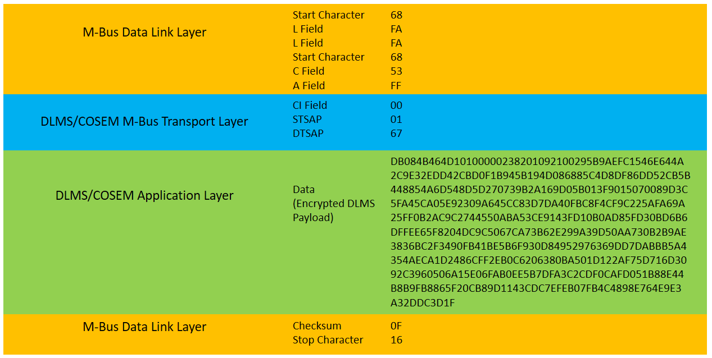
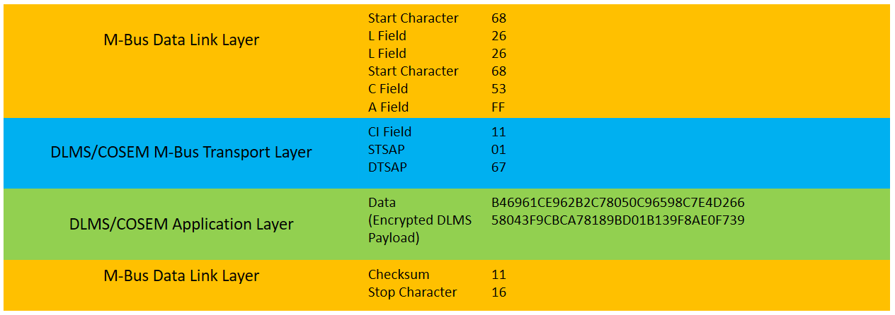
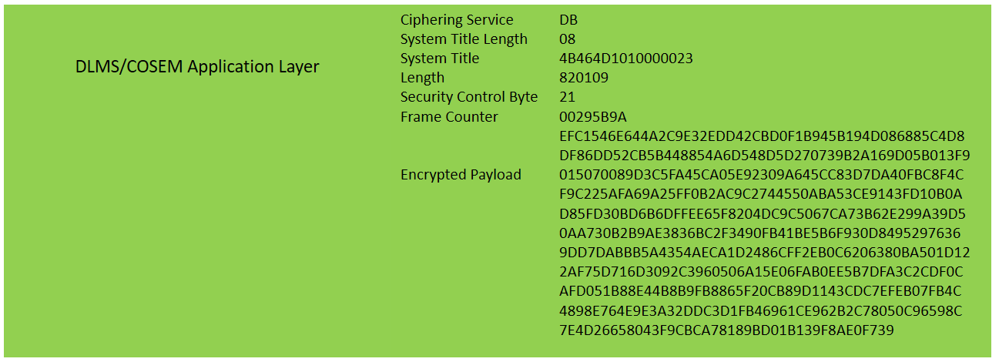
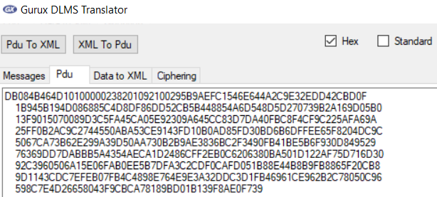
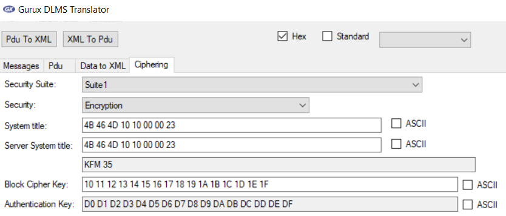
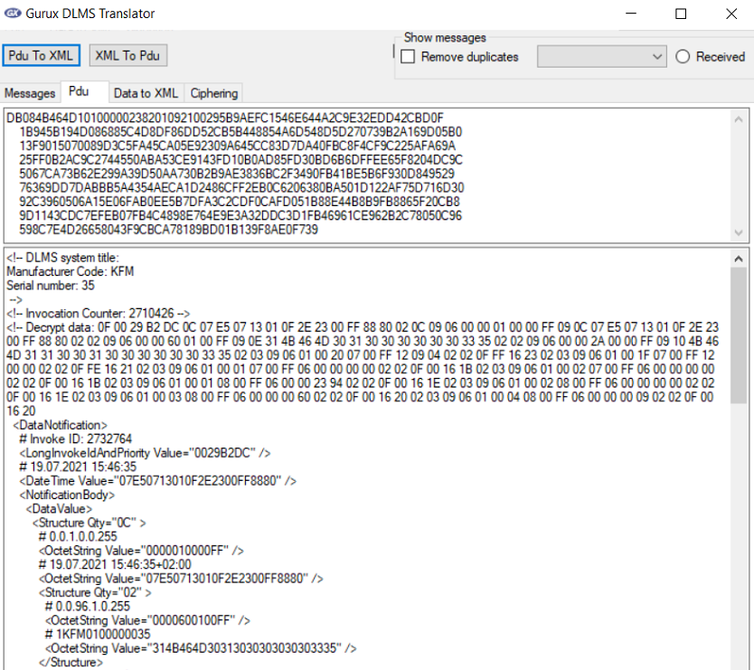

# Smart Meter Kundenschnittstelle - Beispiel

Zum besseren Verständnis der in der [Beschreibung](../README.md) vermittelten
Inhalte zur Kundenschnittstelle betrachten wir hier ein erläuterndes praktisches
Beispiel samt Walkthrough.

# Beispieldaten

Die nachfolgende Byte-Sequenz S, dargestellt in hexadezimaler Schreibweise, repräsentiert
in diesem Zusammenhang ein Bündel an Verbrauchsdaten (Nutzdaten), wie es ein Smart Meter
im unidirektionalen Push-Betrieb im 5 Sekundentakt auf der Kundenschnittstelle ausgeben
würde.

    68FAFA6853FF000167DB084B464D1010
    0000238201092100295B9AEFC1546E64
    4A2C9E32EDD42CBD0F1B945B194D0868
    85C4D8DF86DD52CB5B448854A6D548D5
    D270739B2A169D05B013F9015070089D
    3C5FA45CA05E92309A645CC83D7DA40F
    BC8F4CF9C225AFA69A25FF0B2AC9C274
    4550ABA53CE9143FD10B0AD85FD30BD6
    B6DFFEE65F8204DC9C5067CA73B62E29
    9A39D50AA730B2B9AE3836BC2F3490FB
    41BE5B6F930D84952976369DD7DABBB5
    A4354AECA1D2486CFF2EB0C6206380BA
    501D122AF75D716D3092C3960506A15E
    06FAB0EE5B7DFA3C2CDF0CAFD051B88E
    44B8B9FB8865F20CB89D1143CDC7EFEB
    07FB4C4898E764E9E3A32DDC3D1F0F16
    6826266853FF110167B46961CE962B2C
    78050C96598C7E4D26658043F9CBCA78
    189BD01B139F8AE0F7391116

Bei genauer Betrachtung erkennt man, dass S sich aus 2 M-Bus Frames bzw.
Segmenten zusammensetzt, S = S_1 + S_2, die gemeinsam eine verschlüsselte DLMS/COSEM 
Nachricht transportieren. Beide haben die allgemeine Struktur

    68 L-Field L-Field 68 ... 16

eines M-Bus Frames, aber eine unterschiedliche Länge (L-Field).
In obiger Darstellung entspricht S_2 den letzten 3 Zeilen, während S_1 die
restlichen Zeilen belegt. Gesteuert wird die Segmentierung über die jeweiligen
Control-Information-Felder (CI). Bei einer DLMS-Nachricht, die aufgrund ihrer
Größe in Form von 2 Segmenten übertragen werden muss, ist CI=0x00 für
das 1. Segment und CI=0x11 für das 2. Segment.

## Segment 1

## Segment 2

# Transportierte DLMS/COSEM Nachricht

Nach Verkettung der beiden Nachrichtenteile aus den jeweiligen
DLMS/COSEM Applikationsschichten ergibt sich die folgende (verschlüsselte)
DLMS/COSEM Nachricht:

Nachfolgend auch als Text dargestellt (um copy&paste zu erleichtern):

    DB084B464D10100000238201092100295B9AEFC1546E644A2C9E32EDD42CBD0F
    1B945B194D086885C4D8DF86DD52CB5B448854A6D548D5D270739B2A169D05B0
    13F9015070089D3C5FA45CA05E92309A645CC83D7DA40FBC8F4CF9C225AFA69A
    25FF0B2AC9C2744550ABA53CE9143FD10B0AD85FD30BD6B6DFFEE65F8204DC9C
    5067CA73B62E299A39D50AA730B2B9AE3836BC2F3490FB41BE5B6F930D849529
    76369DD7DABBB5A4354AECA1D2486CFF2EB0C6206380BA501D122AF75D716D30
    92C3960506A15E06FAB0EE5B7DFA3C2CDF0CAFD051B88E44B8B9FB8865F20CB8
    9D1143CDC7EFEB07FB4C4898E764E9E3A32DDC3D1FB46961CE962B2C78050C96
    598C7E4D26658043F9CBCA78189BD01B139F8AE0F739

Für die Entschlüsselung der Daten sind folgende Informationen maßgeblich:

- Modus: Security Suite 1, encryption only, general-glo-ciphering
- Verschlüsselungsalgorithmus: AES-GCM (Advanced Encryption Standard - Galois/Counter Mode)
- Schlüssellänge: 128 bits
- Schlüssel: 10 11 12 13 14 15 16 17 18 19 1A 1B 1C 1D 1E 1F
- Initialisierungsvektor (IV): 96 bits, IV = System Title + Frame Counter = 4B464D101000002300295B9A

Für die Entschlüsselung and anschließende Interpretation der entschlüsselten
(als COSEM-Objekte codierten) Daten kann auf im Internet frei verfügbare
Open-Source-Bibliotheken und Tools zurückgegriffen werden, beispielsweise auf den
[Gurux DLMS Translator](https://www.gurux.fi/GuruxDLMSTranslatorInfo/).

## Gurux DLMS Translator

> Hinweis: Der Gurux DLMS Translator ist in einer Online-Variante und einer
> Offline-Variante (als Teil von Gurux GXDLMSDirector) verfügbar. Zum aktuellen
> Zeitpunkt (07/2021) ist die Unterstützung von Datenver- und -entschlüsselung
> in der Offline-Variante deutlich weiter fortgeschritten.

**Vorgehensweise**

1. Verschlüsselte DLMS/COSEM Nachricht in das Pdu-Feld kopieren

    

2. Folgende kryptographische Einstellungen vornehmen (der Authentication Key
spielt keine Rolle aufgrund des *encryption only* Modus)

    

3. Die Schaltfläche `Pdu to XML` betätigen, um die Entschlüsselung und Dekodierung
durchzuführen und das Resultat anzuzeigen

    

## Alternative - CyberChef

Alternativ kann die Datenentschlüsselung beispielsweise auch mit dem vielseitigen Online-Tool
[CyberChef](https://gchq.github.io/CyberChef/) vorgenommen werden.
Dabei ist allerdings darauf zu achten, dass im Input-Feld nicht die gesamte DLMS/COSEM
Nachricht eingegeben wird, sondern nur die verschlüsselte Payload (beginnend nach dem
Frame Counter).

Unter nachfolgendem Link kann das betrachtete Beispiel (mit vollständig
ausgefüllten Eingabefeldern) in CyberChef inspiziert werden:
[CyberChef-Beispiel](https://gchq.github.io/CyberChef/#recipe=AES_Encrypt(%7B'option':'Hex','string':'101112131415161718191A1B1C1D1E1F'%7D,%7B'option':'Hex','string':'4B464D101000002300295B9A'%7D,'GCM','Hex','Hex',%7B'option':'Hex','string':''%7D)&input=RUZDMTU0NkU2NDRBMkM5RTMyRURENDJDQkQwRjFCOTQ1QjE5NEQwODY4ODVDNEQ4REY4NkRENTJDQjVCNDQ4ODU0QTZENTQ4RDVEMjcwNzM5QjJBMTY5RDA1QjAxM0Y5MDE1MDcwMDg5RDNDNUZBNDVDQTA1RTkyMzA5QTY0NUNDODNEN0RBNDBGQkM4RjRDRjlDMjI1QUZBNjlBMjVGRjBCMkFDOUMyNzQ0NTUwQUJBNTNDRTkxNDNGRDEwQjBBRDg1RkQzMEJENkI2REZGRUU2NUY4MjA0REM5QzUwNjdDQTczQjYyRTI5OUEzOUQ1MEFBNzMwQjJCOUFFMzgzNkJDMkYzNDkwRkI0MUJFNUI2RjkzMEQ4NDk1Mjk3NjM2OUREN0RBQkJCNUE0MzU0QUVDQTFEMjQ4NkNGRjJFQjBDNjIwNjM4MEJBNTAxRDEyMkFGNzVENzE2RDMwOTJDMzk2MDUwNkExNUUwNkZBQjBFRTVCN0RGQTNDMkNERjBDQUZEMDUxQjg4RTQ0QjhCOUZCODg2NUYyMENCODlEMTE0M0NEQzdFRkVCMDdGQjRDNDg5OEU3NjRFOUUzQTMyRERDM0QxRkI0Njk2MUNFOTYyQjJDNzgwNTBDOTY1OThDN0U0RDI2NjU4MDQzRjlDQkNBNzgxODlCRDAxQjEzOUY4QUUwRjczOQ)

Als Resultat erhält man im Output-Feld die folgende (nun entschlüsselte) Byte-Sequenz,
in der die Nutzdaten als COSEM-Objekte codiert sind. Die Dekodierung kann (analog wie
oben) mit dem Gurux DLMS Translator über die Schaltfläche `Pdu to XML`
vorgenommen werden.

    0f0029b2dc0c07e50713010f2e2300ff8880020c09060000010000ff090c07e5
    0713010f2e2300ff8880020209060000600100ff090e314b464d303130303030
    303033350202090600002a0000ff09104b464d31313030313030303030303335
    020309060100200700ff12090402020fff16230203090601001f0700ff120000
    02020ffe1621020309060100010700ff060000000002020f00161b0203090601
    00020700ff060000000002020f00161b020309060100010800ff060000239402
    020f00161e020309060100020800ff060000000002020f00161e020309060100
    030800ff060000006002020f001620020309060100040800ff06000000090202
    0f001620
